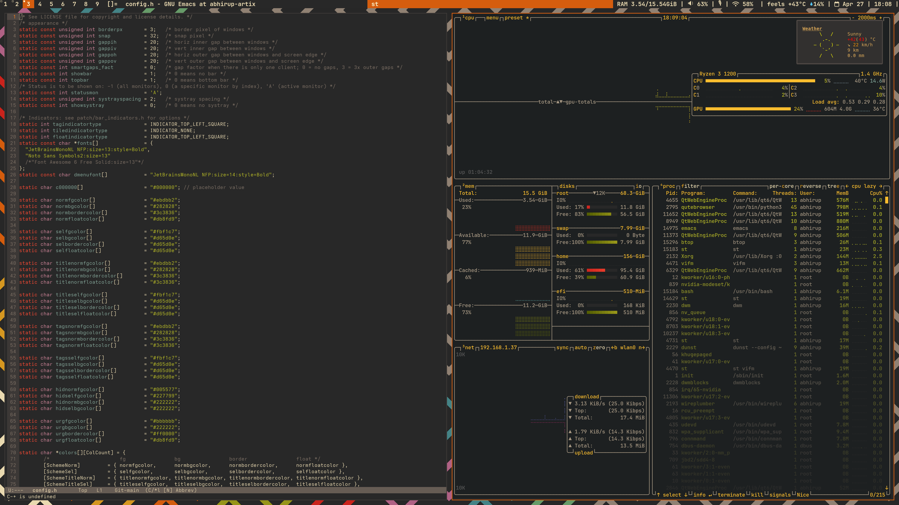
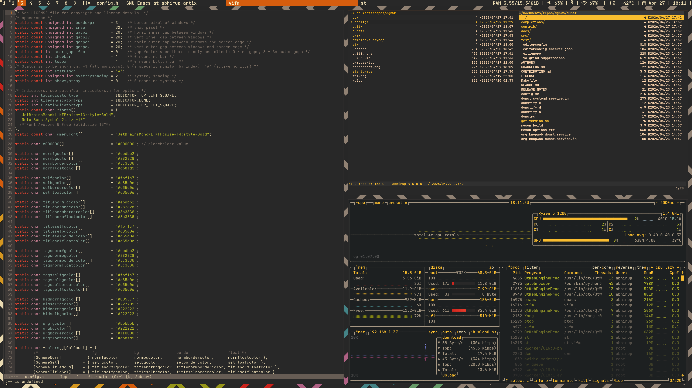
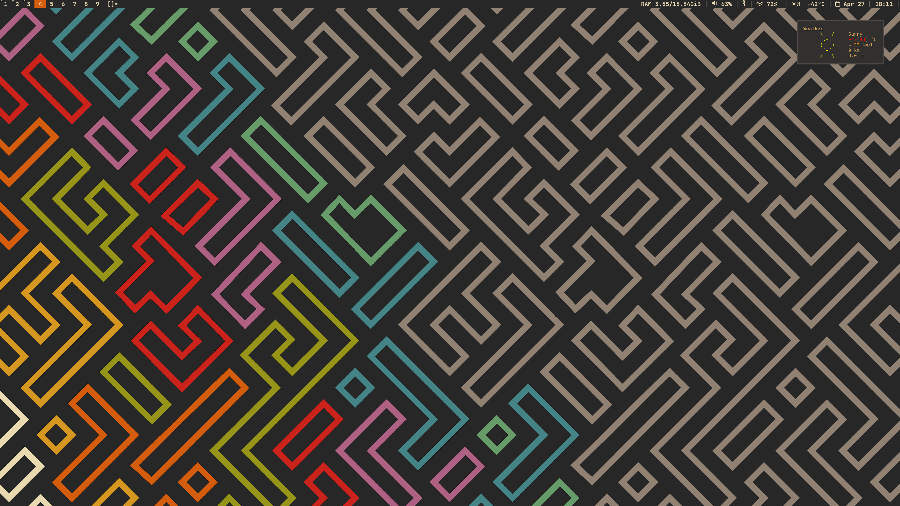

# The Dynamic GruvBox Window Manager







This is my dwm configuration files. Here you'll find:
- dwm
- dwmblocks
- dunst
- st

## Dependencies
Note: On non arch based distros, you'll need to install these by yourself if they aren't already.

- Xlibre or X11 server (duh)
- libx11
- feh
- pod2man
- pango
- libxrandr libxinerama libxss
- flameshot (optional, only for screenshots)

### Fonts required

- ttf-jetbrains-mono-nerd
- ttf-nerd-fonts-symbols
- ttf-hack-nerd

## Installation

```bash
git clone https://github.com/QuantaDude/dgbwm && cd dgbwm && chmod +x install_dgbwm.sh && sudo ./install_dgbwm.sh
```
or
```bash
git clone https://github.com/QuantaDude/dgbwm
cd dgbwm
chmod +x install_dgbwm.sh
sudo ./install_dgbwm.sh
```
## Configuration

If you want to change some settings after installing, let's say the wallpaper, you can do so by running:

```bash
dgbwm-config
```
You'll need to place your wallpapers in $HOME/.local/share/dgbwm/

## Other wonderful software to use along

- vifm
- qutebrowser
- ly (login screen/ manager)
- emacs
- btop 
